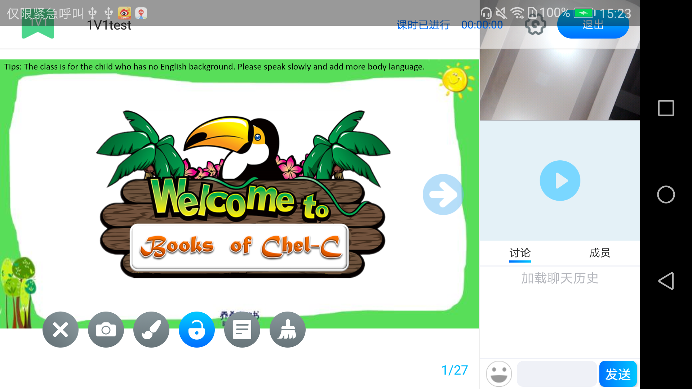

## Android SDK使用说明文档 ##
- 将AAR包**qiansdk-x.x.x.aar**导入主项目中
- 方法的调用： 
	在需要接入处调用如下方法 
	**ClassroomActivity.jumpToClassroomActivity(Context contex, String voucher);**

		context					上下文
		voucher					进入房间的协议信息

* 白板界面: 

- 打包混淆

		-keep class io.agora.rtc.**{*;}
		-keep class com.pili.pldroid.player.**{*;}
		-keep class tv.danmaku.ijk.**{*;}
		-keep class com.qianclass.qclasssdk.** { *; }
		-keep class com.eclass.talklive.imsdk.** { *; }
		-keep class com.eclass.talklive.easylive.** { *; }
		-keep class com.eclass.graffitiview.** { *; }